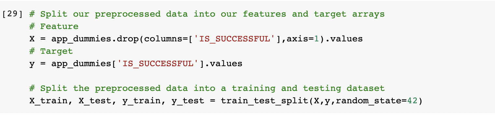
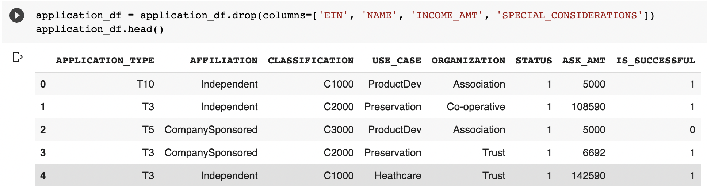
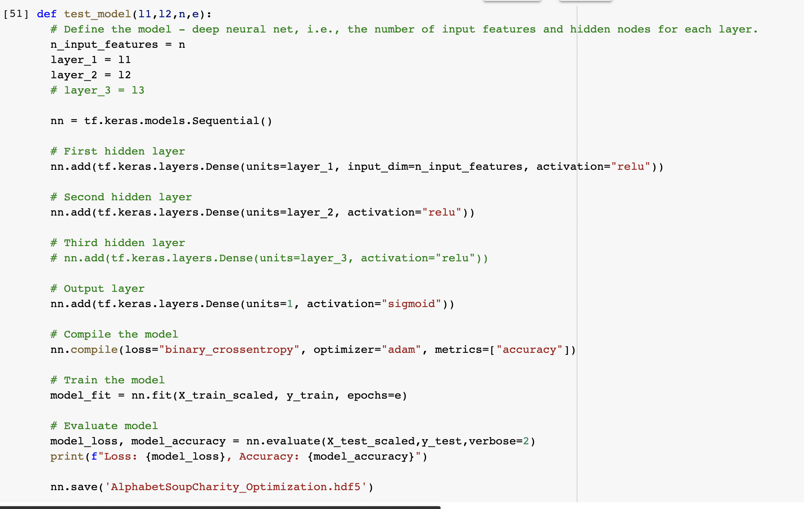

## Overview

The purpose of this analysis is to train, test, and optimize a binary classification machine learning model in order to predict if applicants will be successful if they receive funding from non-profit foundation Alphabet Soup.

## Results

### Data Preprocessing

* What variable(s) are the target(s) for your model?
    * The `IS_SUCCESSFUL` column will be the target for our model as that is the information we are trying to predict with our model.
    
* What variable(s) are the features for your model?
    * The features are the other columns in the dataset, excluding the columns listed below.
* What variable(s) should be removed from the input data because they are neither targets nor features?
    * `EID`, `NAME` - and after optimization - the `INCOME_AMT` and `SPECIAL_CONSIDERATIONS` columns were removed from the model prior to testing.
    

### Compiling, Training, and Evaluating the Model

* How many neurons, layers, and activation functions did you select for your neural network model, and why?
    * Two hidden layers, 35 input features, and 100, 120, then 200 epochs during model evaluation and optimization. 200 neurons in the first hidden layer and 80 neurons in the second hidden layer yielded the best performance.
* Were you able to achieve the target model performance?
    * I was unable to achieve the target model performance of 75%, only being able to achieve 73.2% performance.
* What steps did you take in your attempts to increase model performance?
    * During the optimization process, two additional columns were removed as they weren't used within the model: `INCOME_AMT` and `SPECIAL_CONSIDERATIONS`. In addition, varying numbers of hidden layer units and epochs were tried with minimal improvement to the model. Finally, additional hidden layers were added but again yielded minimal improvement to the model. The number of values were also decreased for each bin.

## Summary

The optimized model's performance was generally lowered the more hidden layers and features were added, which would seem to imply that the model is over-fit. A larger dataset could help to train our model better and increase model performance. As I was unable to achieve the target model performance, perhaps a different form of model would be better suited to the dataset and potentially yield more accurate results, for example a Random Forest Classifier which may lessen the chances of overfitting the data.